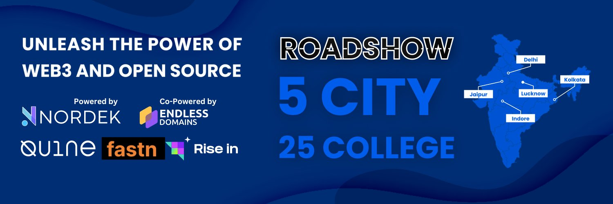
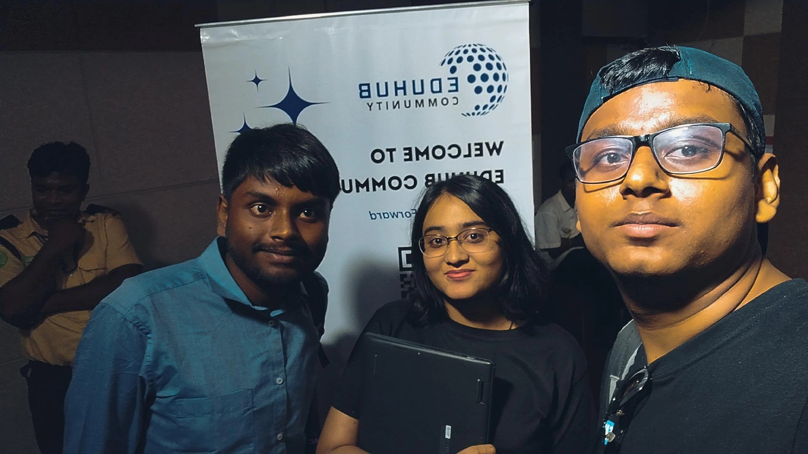

# Unveiling the Future: Eduhub Community's Web3 Roadshow in Kolkata 🌐💻

---

***Date: 11th September 2023***

***Venue: Sister Nivedita University (SNU) at New Town***

## **About This Event**

Eduhub Community, a trailblazer in fostering collaborative learning environments, brought its visionary "Unveiling the Future: Web3, Web Development, and Open-Source College Roadshow" to Kolkata, West Bengal, on Monday, September 11th. This event was a testament to Eduhub's commitment to providing a platform for individuals to explore and understand the future landscape of technology.

## **Learning the Ropes of Web3 and Crypto**

The roadshow commenced with an immersive exploration of Web3 and cryptocurrency. Seasoned industry experts took center stage, demystifying the complexities of these cutting-edge technologies. As a participant, the wealth of knowledge gained during these sessions provided invaluable insights into the ever-evolving realm of web development.

## **Networking Extravaganza**

***Pic: Me with the founder of EduHub Community [Priya Chandak](https://www.linkedin.com/in/priya-chandak-ba0a6b178/) and my friend [Anjishnu Ganguly](https://www.linkedin.com/in/anjishnu-ganguly-722046284/)***

Beyond the informative sessions, the event provided an excellent platform for networking. Attendees had the opportunity to connect with like-minded individuals from Eduhub Community and engage with fellow students from SNU (Sister Nivedita University). The exchange of ideas and experiences during these interactions added an extra layer of depth to the entire experience.

## **A Heartfelt Thank You**

I extend my sincere gratitude to Eduhub Community for orchestrating this enlightening roadshow. The dedication and effort put into curating an event of this caliber were evident, and the impact will undoubtedly resonate within the tech community for a long time.

## **Looking to the Future**

As we step into the future of technology, innovation, and collaborative learning, the seeds planted during this event are bound to flourish. The knowledge gained and connections forged will undoubtedly contribute to the collective progress of the web development and open-source communities.

## **Conclusion**

In conclusion, the Web3 Roadshow in Kolkata was more than just an event; it was a transformative experience that offered a glimpse into the future of technology. My heartfelt thanks to everyone involved in making this opportunity possible. Here's to the continued growth of technology and the collaborative spirit that drives it forward!

*Stay connected, stay innovative!* 🌐✨

## LinkedIn Post

