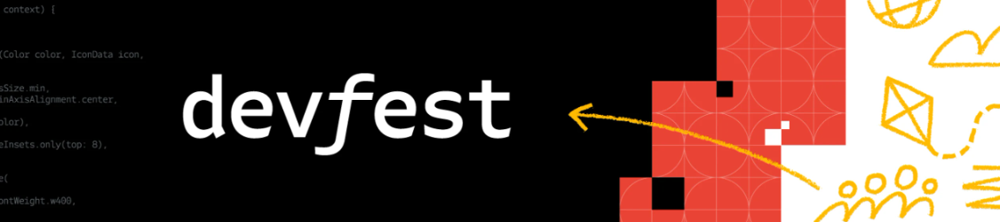
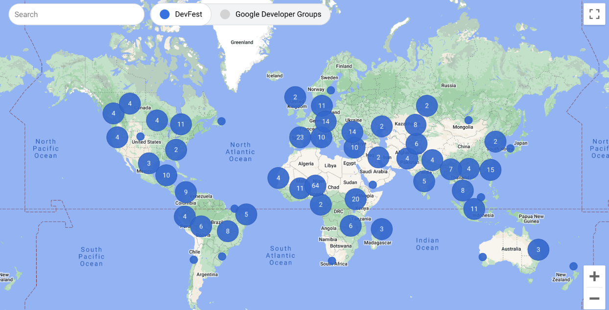
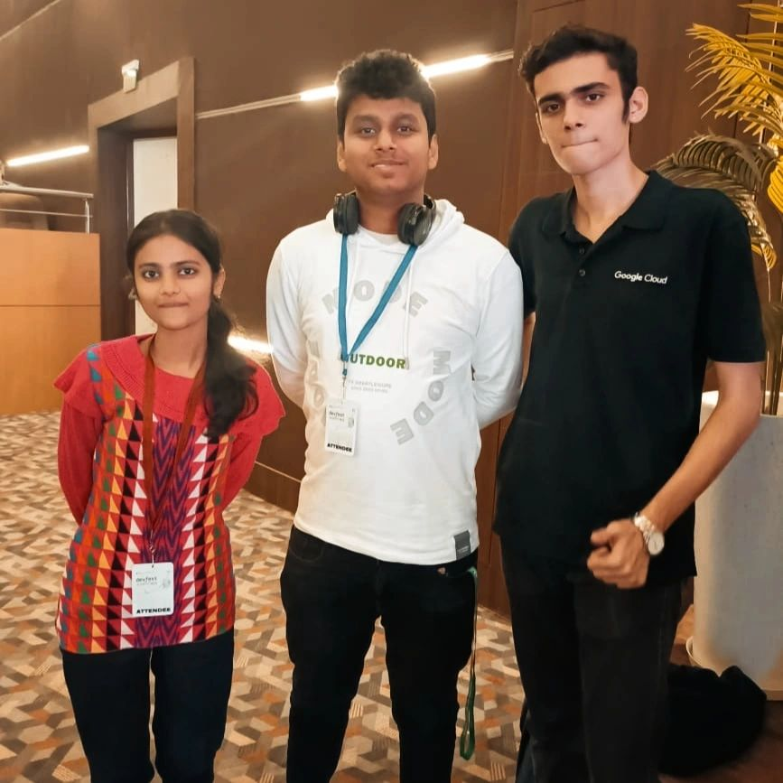
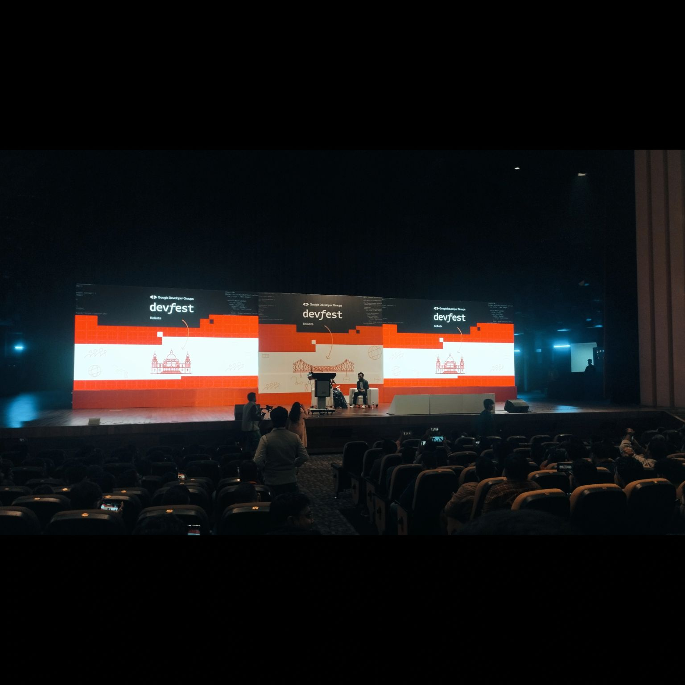

# GDG Kolkata Devfest 2023: A Tech Extravaganza 🌐🚀

---

***Date: 22nd December 2023.***

***Venue: Dhono Dhanyo Auditorium, Thackeray Road, Kolkata, 700027.***

## What is a GDG Devfest?

DevFest is a global tech conference hosted by the Google Developer Groups (GDG) community. It's a place for tech communities to connect, learn, and explore the latest Google developer tools.

***Pic: Locations of Devfest all around the world.***

Hey Devfest enthusiasts! 👋 I hope this post finds you as exhilarated as I am after an amazing weekend at GDG Kolkata Devfest 2023. Let me take you through the highlights of this mind-blowing tech extravaganza that left me buzzing with inspiration! ✨

## Electrifying Kickoff

The day started with an electrifying keynote that set the tone for the entire event. Visionaries from the tech industry took the stage, sharing insights on the latest trends, cutting-edge technologies, and the exciting future of development. It was a promising start to a day filled with innovation and collaboration.

## Standout Sessions

The standout sessions by Aryan Irani, Pawan Kumar, Saaket Tharad, Sayak Paul, Hrittik Roy, and many others were nothing short of extraordinary. They delved into diverse topics like Generative AI, Startups, Entrepreneurship, Marketing, and Sales. The speakers not only unraveled complexities but also shared practical tips for implementation. My mind was officially blown! 🤯

## Meeting Striver - A Highlight!

***Pic: Live Session with Striver.***

A special highlight for me was getting the chance to meet Raj Vikramaditya, AKA Striver 🎖. Connecting with industry leaders adds a unique flavor to such events and provides valuable insights into the real-world applications of technology.

## Hands-on Workshops: A Game-Changer

The hands-on workshops were an absolute game-changer. Kudos to the workshop facilitators who made complex concepts feel like a breeze! It was a fantastic opportunity to dive deep into practical aspects and enhance my skills. 🛠️💻

## Community and Networking

***Pic: Me with [Ayushi Srivastava](https://www.linkedin.com/in/ayushi-srivastava-511914234/) and [Aryan Irani](https://www.linkedin.com/in/aryan-irani-41b2971a9/).***

The GDG Kolkata community knows how to make learning fun, and the networking opportunities were off the charts. Meeting like-minded developers, exchanging ideas, and finding potential collaborators for future projects created a sense of community that is truly unmatched. 🤝🌐

## Swag Galore

No tech event is complete without some swag, and the GDG Kolkata team did not disappoint. Rocking my new Devfest Shirt as a badge of honor! 😎👾

## Shoutout to the Organizers, Volunteers, and Sponsors

A massive shoutout to the organizers Indranil Dutta, Binit Kumar Mondal, Aindrila Das, volunteers (especially my college senior Prasun kr Mondal), and all the others who put their heart and soul into making this unforgettable experience possible. Your hard work and dedication to fostering the local tech community do not go unnoticed! 🙌🏽👏🏽

## Learning 

I was able to learn a great deal about the newest generation of artificial intelligence, generative AI, and what it takes to launch a profitable business and pursue entrepreneurship. Additionally, we learned about some of Google's newest technologies and how they will facilitate quicker and more effective development work.

## Looking Ahead to Devfest 2024

Already counting down the days until GDG Kolkata Devfest 2024! 📆 Until then, let's keep the conversation going, share our learnings, and continue to push the boundaries of what's possible in the tech world. 🚀💻 #GDGKolkata #Devfest2023 #TechInnovation #CommunityFirst

See you at the next Devfest adventure! 🌐🚀✨

## LinkedIn Post

## Medium Post

