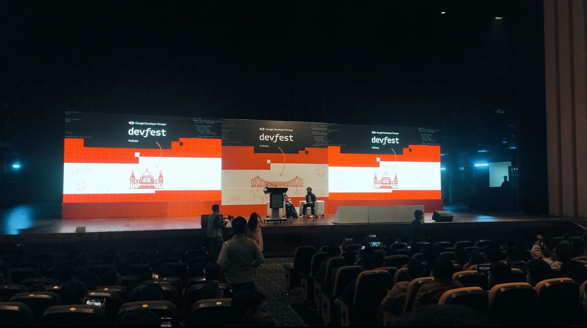

# GDG Kolkata Devfest 2023

---

Hey Devfest enthusiasts! 🌐 Just had the most exhilarating weekend at GDG Kolkata Devfest 2023 and I can't wait to share the highlights with you all! 🚀✨

From mind-blowing tech talks to hands-on workshops, the GDG Kolkata Devfest was a melting pot of innovation, collaboration, and endless inspiration. 💡💻

The day kicked off with an electrifying keynote that set the tone for the entire event. Visionaries from the tech industry shared their insights on the latest trends, cutting-edge technologies, and the future of development.

Standout sessions were given by Aryan Irani, Pawan Kumar, Saaket Tharad, Sayak Paul, Hrittik Roy, and many others, who deep dive into topics like Generative AI, Startups, Entrepreneurship, Marketing and Sales, where they unpacked the complexities and shared practical tips for implementation. Mind officially blown! 🤯

Also got the chance to meet Raj Vikramaditya AKA Strider🎖 the man himself.

But it wasn't just about absorbing information; the hands-on workshops were an absolute game-changer. Shoutout to the amazing workshop facilitators who made complex concepts feel like a breeze! 🛠️💻

The GDG Kolkata community truly knows how to make learning fun, and the networking opportunities were off the charts. Met some incredible like-minded developers, exchanged ideas, and even found potential collaborators for future projects. The sense of community at Devfest is unmatched! 🤝🌐

Of course, no tech event is complete without some swag, and the GDG Kolkata team did not disappoint. Rocking my new Devfest Shirt as a badge of honor! 😎👾

A massive shoutout to the organizers Indranil Dutta, Binit Kumar Mondal and Aindrila Das, volunteers specially my college senior Prasun kr Mondal and all the others, and sponsors who made this unforgettable experience possible. Your hard work and dedication to fostering the local tech community do not go unnoticed! 🙌🏽👏🏽

Already counting down the days until GDG Kolkata Devfest 2024! 📆 Until then, let's keep the conversation going, share our learnings, and continue to push the boundaries of what's possible in the tech world. 🚀💻