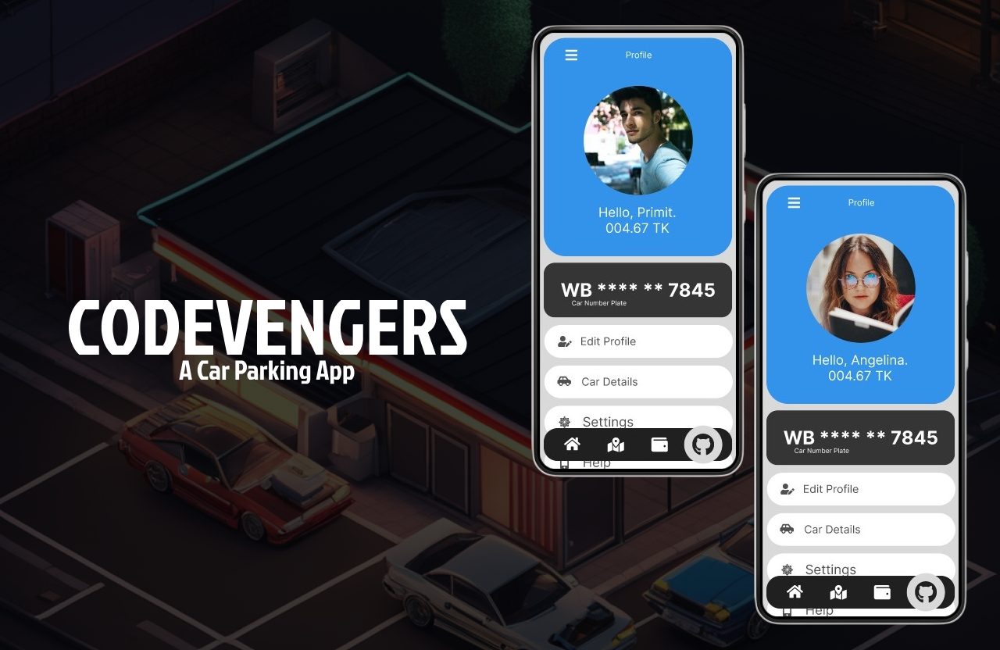

# Hacking Solutions: A Journey Through Smart India Hackathon

***Date: September 2023***

The Smart India Hackathon (SIH) is more than just a competition; it's a nationwide initiative by the innovation cell of the Ministry of Education that opens doors for students to tackle real-world challenges faced by the government, ministries, departments, industries, and other organizations. This year, my friends and I embarked on a thrilling journey in the hackathon, where we aimed to revolutionize street parking using the power of Artificial Intelligence (AI) and Machine Learning (ML).

## The Genesis of the Idea

Our team's journey began with brainstorming sessions, heated discussions, and a shared passion for making a positive impact. Lead by Promit we were eager to contribute our skills towards solving a problem that mattered, and after careful consideration, we zeroed in on the challenge of optimizing street parking. With the increasing urbanization, parking has become a ubiquitous issue, and we believed that AI and ML could be the game-changer.

## Diving into Development

Once the idea was solidified, the real work began. Late-night coding sessions, endless cups of coffee, and a collaborative spirit defined our days. We leveraged our diverse skills, with each team member bringing a unique expertise to the table. From data collection and model training to app development, our roles intertwined seamlessly. Shivaditya single handedly made out mobile app with the design which Sneha came with.

## Challenges Faced and Lessons Learned

The journey was not without its challenges. We encountered roadblocks, faced setbacks, and had to pivot our approach at times. Yet, it was precisely these challenges that taught us resilience, problem-solving, and the importance of teamwork. We learned to appreciate the value of failure as a stepping stone to success.

## The Thrill of the Hackathon

As the hackathon deadline approached, the excitement reached a crescendo. We fine-tuned our project, prepared a compelling presentation, and anxiously awaited the opportunity to showcase our solution. The virtual platform of SIH connected us with mentors and experts, offering valuable feedback that helped refine our project further, but there was a problem the model was no were near 100 percent accuracy the dataset was not big enough.

## Team Spirit and Camaraderie

One of the most rewarding aspects of the SIH experience was the camaraderie among team members. Working with friends brought an added layer of trust, effective communication, and shared goals. We celebrated small victories and supported each other during challenging moments, creating memories that extended beyond the hackathon itself.

## Presenting Our Solution

The moment arrived when we presented our AI and ML-driven street parking solution to a panel of judges. The presentations were delivered by our lead Promit. The culmination of months of hard work and dedication was encapsulated in those minutes. The nerves were palpable, but our belief in the potential impact of our project fueled our presentation. 

Because of Promit's presentation, we were able to easily pass the college's first round of selection and even win on the last day of selection.

## Beyond the Hackathon

While we were not selected to the national level, the experience itself has been a victory. The SIH journey not only equipped us with technical skills but also honed our teamwork, problem-solving abilities, and resilience. We're proud of what we've achieved and excited about the potential our solution holds for addressing real-world challenges.

## Our Team👷‍♂️

***Team: CODEVENGERS*** 

**Lead: [Promit Chaudhuri](https://github.com/ProSkywalker16)**  
**Concept:** [Promit Chaudhuri](https://github.com/ProSkywalker16) and [Subhadip Santra](https://github.com/Subhadip05Santra)  
**Design & UI/UX:** [Debarshee Chakraborty](https://github.com/debarshee2004), [Promit Chaudhuri](https://github.com/ProSkywalker16) and [Sneha Chakraborty](https://github.com/SnehaChakraborty-007)  
**Frontend:** [Shivaditya Bhattacharya](https://github.com/RichPerspective007) and [Promit Chaudhuri](https://github.com/ProSkywalker16)  
**Backend:** [Debarshee Chakraborty](https://github.com/debarshee2004), [Promit Chaudhuri](https://github.com/ProSkywalker16), [Soham Banerjee](https://github.com/sohambanerjee10) and [Sneha Chakraborty](https://github.com/SnehaChakraborty-007)  
**API:** [Subhadip Santra](https://github.com/Subhadip05Santra) and [Soham Bannerjee](https://github.com/sohambanerjee10)  
**Artificial Intelligence and Machine Learning:**[Debarshee Chakraborty](https://github.com/debarshee2004) 
**Documentation:** [Debarshee Chakraborty](https://github.com/debarshee2004) and [Promit Chaudhuri](https://github.com/ProSkywalker16)

## Our Project

***Pic: Team Codevenger's Banner***

The Smart India Hackathon was more than a competition; it was a transformative experience that showcased the power of collaboration, innovation, and the indomitable spirit of the youth. As we eagerly await the results, we know that our journey doesn't end here. It's a stepping stone to future endeavors where technology meets social impact. The hackathon was not just about solving problems; it was about shaping a future where innovation thrives and challenges are met with ingenuity.

## Learning 📚

I learned a great deal, and this is when my passion for Artificial Intelligence and Machine Learning began. I had the chance to learn a lot about management, effective teamwork, and bug fixing while working with this team. A significant component of teamwork is imparting knowledge and learning from others. Even though Shivaditya was the event's MVP, nothing would have been possible without everyone's help.

## LinkedIn Post

