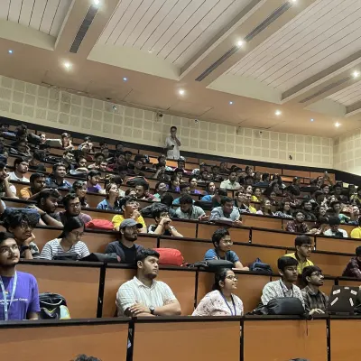
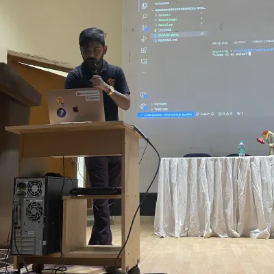
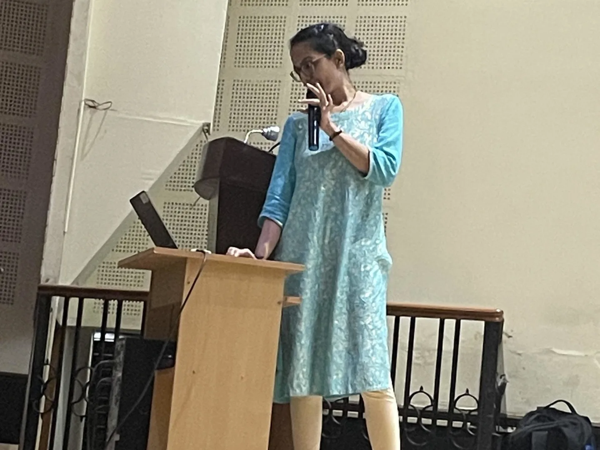
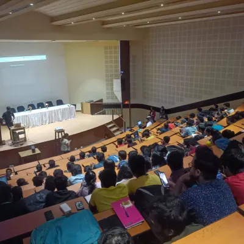

# Embark on an Insightful Journey: 'Generative AI with Google Cloud' Event in Kolkata 🚀🤖

---

***Date: 23rd September 2023***

***Venue: Academy of Technology Grand Trunk Road Krishnapur Chandanpur, 712502***

## **Invitation to the Future: 'Generative AI with Google Cloud'**

I am thrilled to extend a warm invitation to all AI enthusiasts, developers, and industry professionals for an extraordinary event organized by Google Developer Group Cloud Kolkata. Titled 'Generative AI with Google Cloud,' this was gathering promises to be an enlightening exploration into the captivating realm of Generative AI and its vast applications.

***Pic: AOT's Auditorium***

## **Anticipating Engaging Talks and Insights**

As I was eagerly anticipating the event, I'm excited about the series of engaging talks that have been meticulously curated to delve into the intricacies of Generative AI. These talks will not only unravel the potential of Generative AI but also provide invaluable insights into how it can be effectively utilized across various applications.

***Pic: [Rishiraj Acharya](https://twitter.com/RishirajAcharya) giving a speech.***

## **Learn from Industry Experts**

What made this event truly special was the opportunity to learn from industry experts who are at the forefront of this rapidly evolving field. Their knowledge and experiences are sure to enrich our understanding of Generative AI, made this event a must-attend for anyone passionate about artificial intelligence.

***Pic: [Vaidehi Khalpada](https://twitter.com/KhalpadaVaidehi) giving a speech.***

## **Networking Opportunities**

Beyond the educational aspect, this event offers a unique chance to connect with like-minded individuals. Whether you're a seasoned professional or a budding enthusiast, the atmosphere was conducive to network and foster collaborations that could potentially shape the future of AI.

***Pic: Me with my classmates***

## **Crucial Platform for Technological Advancements**

In the dynamic landscape of technology, events like these serve as crucial platforms for staying updated on the latest trends and innovations. 'Generative AI with Google Cloud' is not just an event; it's a journey into the future of AI, and I am genuinely excited to be a part of it. I Learned a lot and at the end we all got special treat from them. 

***Pic: AOT's Auditorium***

*Stay curious, stay innovative!* 🚀🤖

## LinkedIn Post

